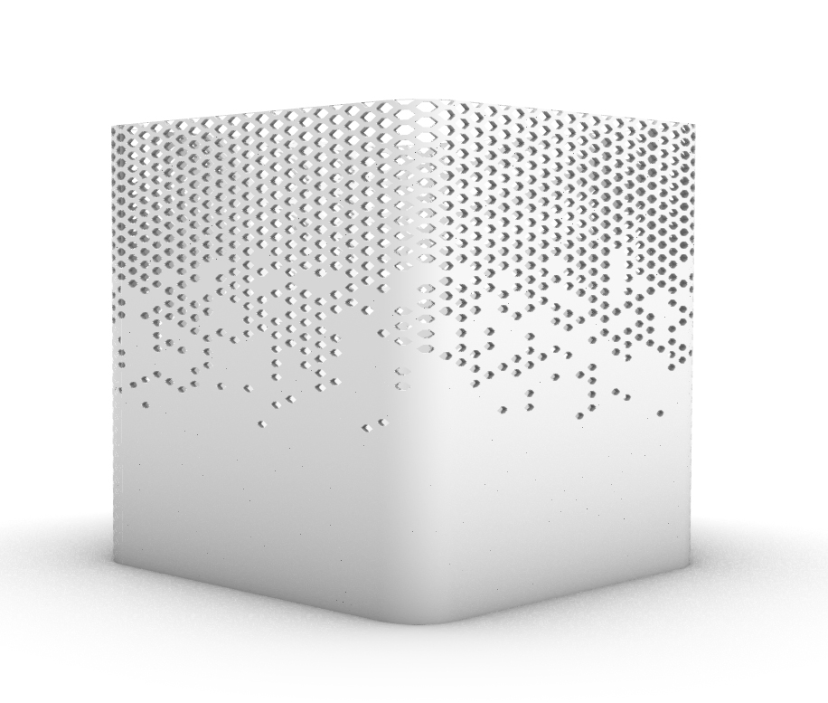
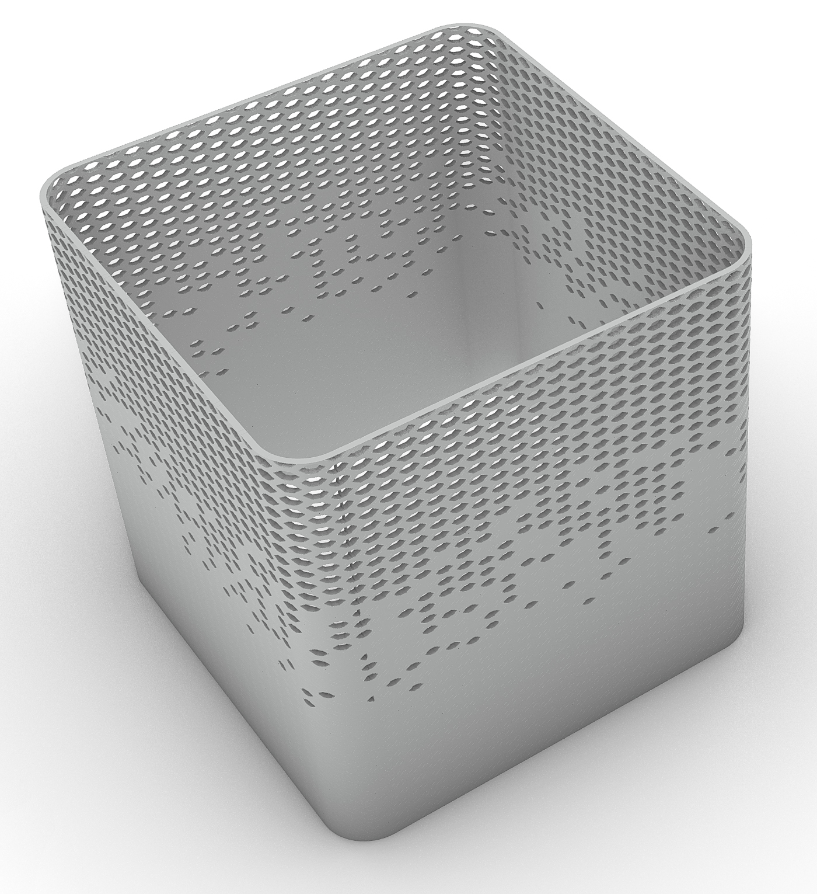
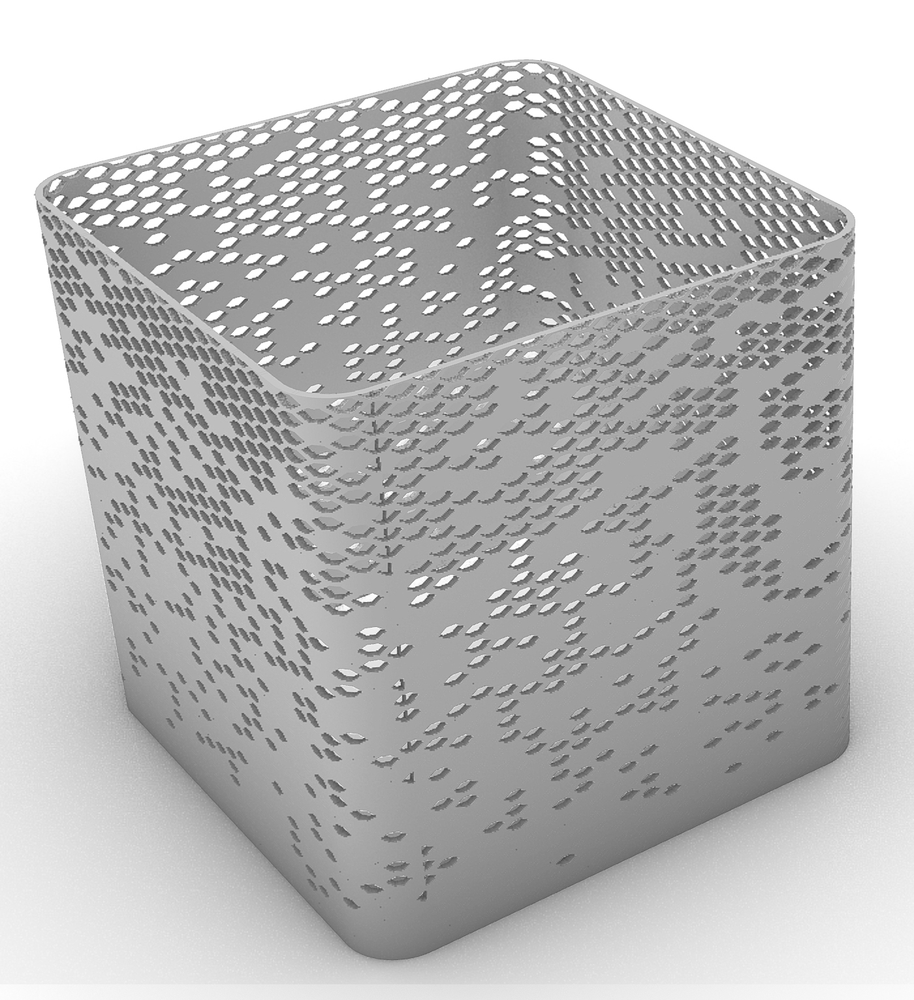
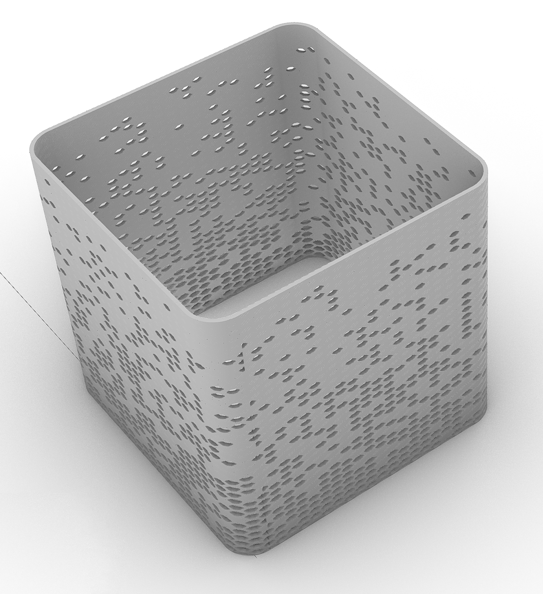

# Hexagonal-Facade-System-with-Attractor-Based-Control

This project explores a parametric facade system based on a hexagonal grid, developed in Grasshopper using line-attractor-based logic. The focus is on controlling geometric variation through simple and adjustable rules.

Concept

The facade is generated from s hexagonal grid constructed using the Grasshopper Lunchbox plugin. 
Variation in the scale of the hexagonal cells is introduced through a line attractor, allowing gradual and controllable changes across the surface.
Closed hexagonal cells are generated using the same attractor logic, with the addition of controlled randomness through jitter. The jitter intentionally breaks the strict attractor influence and can be adjusted via a slider to control its intensity.

The resulting geometry is then morphed onto the facade surface.

  

  

  

  

